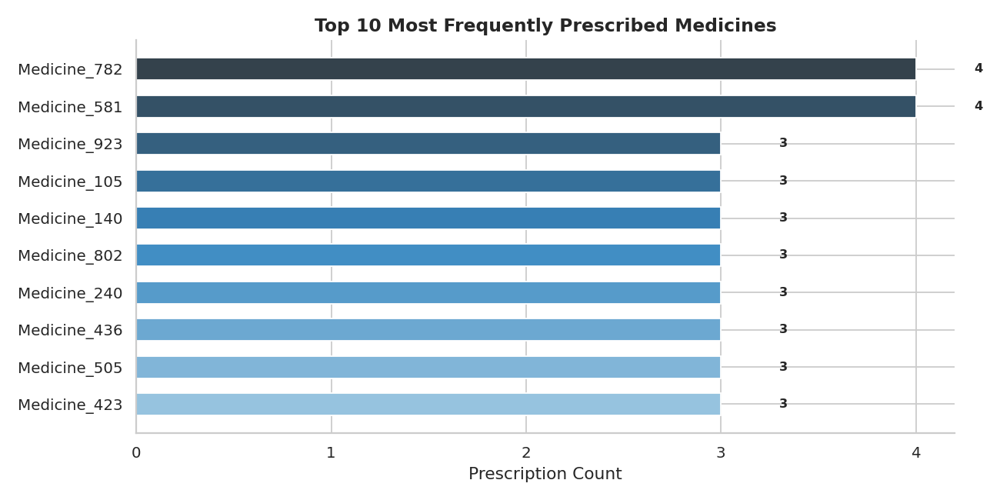
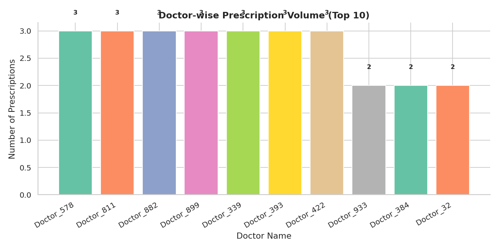
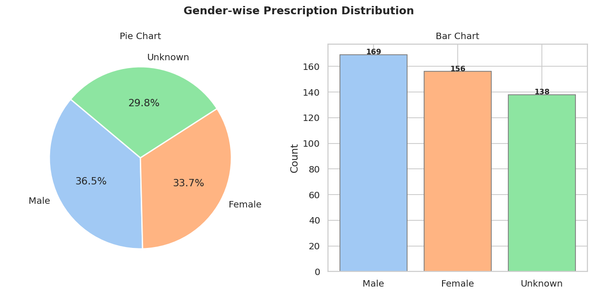
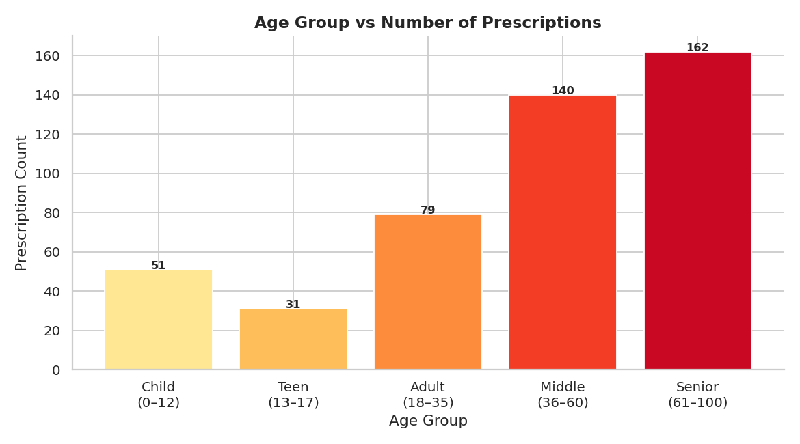
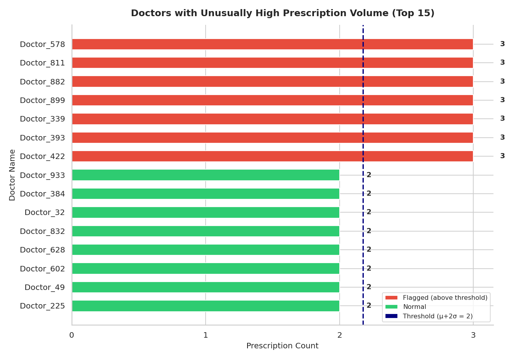
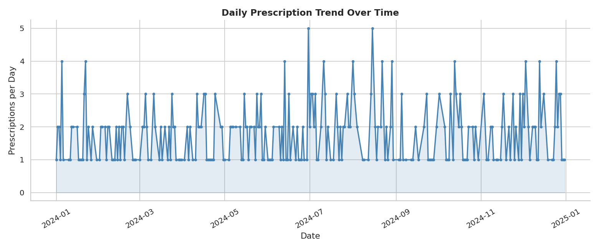
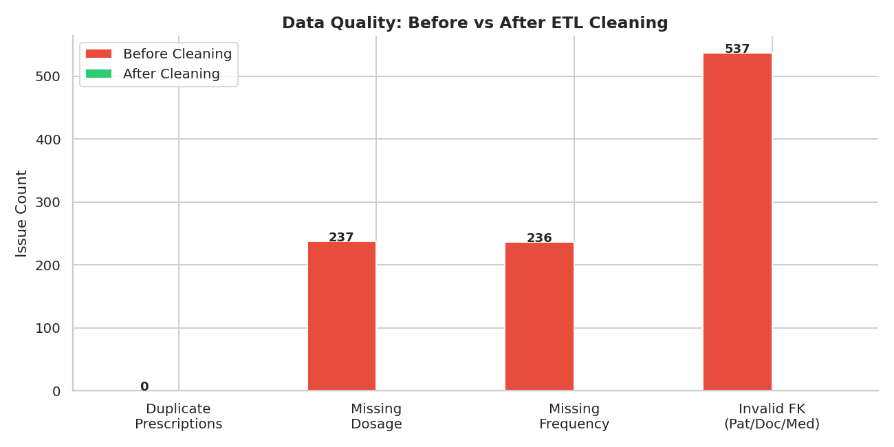

# 💊 Digital Prescription Record Analysis

A comprehensive **ETL pipeline and analytics** project that ingests raw, messy prescription data from CSV files, enforces business rules, loads clean data into a **MySQL** relational database, and produces actionable **business insights** through SQL analytics and rich **Matplotlib/Seaborn** dashboards.

---

## 📌 Table of Contents

- [Overview](#overview)
- [Architecture & Pipeline Flow](#architecture--pipeline-flow)
- [Tech Stack](#tech-stack)
- [Dataset Description](#dataset-description)
- [Database Schema (DDL)](#database-schema-ddl)
- [Business Rules](#business-rules)
- [ETL Pipeline](#etl-pipeline)
- [Business Insights & Visualizations](#business-insights--visualizations)
- [Project Structure](#project-structure)
- [Getting Started](#getting-started)
- [Sample Visualizations](#sample-visualizations)

---

## Overview

Healthcare systems generate vast amounts of prescription data daily. This project simulates a real-world scenario where **raw, unclean CSV data** must be transformed through a robust ETL pipeline into a normalized relational database, then analyzed to derive meaningful insights for healthcare stakeholders.

The pipeline handles:
- **1,000 patients**, **1,000 doctors**, **1,000 medicines**, and **1,000 prescriptions** from CSV sources
- Data quality issues such as duplicates, null values, invalid foreign keys, and out-of-range values
- End-to-end flow from dirty data → clean MySQL tables → analytical dashboards

---

## Architecture & Pipeline Flow

```
CSV files (dirty data)
        ↓
Python ETL (Pandas)
  - Deduplication
  - Null handling
  - Business rule enforcement
  - Foreign key validation
        ↓
MySQL clean tables (DDL + constraints)
        ↓
SQL analytics + Matplotlib/Seaborn dashboards
```

---

## Tech Stack

| Layer          | Technology                                   |
| -------------- | -------------------------------------------- |
| Language       | Python 3                                     |
| ETL            | Pandas, NumPy                                |
| Database       | MySQL                                        |
| DB Connector   | PyMySQL, SQLAlchemy, mysql-connector-python   |
| Visualization  | Matplotlib, Seaborn                          |
| Environment    | Jupyter Notebook                             |

---

## Dataset Description

All datasets reside in the `Datasets/` directory:

| File                     | Records | Key Columns                                                |
| ------------------------ | ------- | ---------------------------------------------------------- |
| `patients_1000.csv`      | 1,000   | `patient_id`, `patient_name`, `gender`, `age`, `contact_no`|
| `doctors_1000.csv`       | 1,000   | `doctor_id`, `doctor_name`, `specialization`, `hospital_name`|
| `medicines_1000.csv`     | 1,000   | `medicine_id`, `medicine_name`, `category`                 |
| `prescriptions_1000.csv` | 1,000   | `prescription_id`, `patient_id`, `doctor_id`, `medicine_id`, `dosage`, `frequency`, `prescribed_date` |

---

## Database Schema (DDL)

The project creates and populates four normalized tables inside the `digital_prescription_db` MySQL database:

```sql
-- Patients table
CREATE TABLE patients (
    patient_id     VARCHAR(10)  PRIMARY KEY,
    patient_name   VARCHAR(100) NOT NULL,
    gender         CHAR(1)      DEFAULT 'U' CHECK (gender IN ('M','F','U')),
    age            INT          CHECK (age BETWEEN 0 AND 100),
    contact_no     VARCHAR(15),
    created_at     TIMESTAMP    DEFAULT CURRENT_TIMESTAMP
);

-- Doctors table
CREATE TABLE doctors (
    doctor_id       VARCHAR(10)  PRIMARY KEY,
    doctor_name     VARCHAR(100) NOT NULL,
    specialization  VARCHAR(100),
    hospital_name   VARCHAR(100),
    created_at      TIMESTAMP    DEFAULT CURRENT_TIMESTAMP
);

-- Medicines table
CREATE TABLE medicines (
    medicine_id    VARCHAR(10)  PRIMARY KEY,
    medicine_name  VARCHAR(100) NOT NULL,
    category       VARCHAR(50),
    created_at     TIMESTAMP    DEFAULT CURRENT_TIMESTAMP
);

-- Prescriptions table
CREATE TABLE prescriptions (
    prescription_id  VARCHAR(10) PRIMARY KEY,
    patient_id       VARCHAR(10) NOT NULL,
    doctor_id        VARCHAR(10) NOT NULL,
    medicine_id      VARCHAR(10) NOT NULL,
    dosage           VARCHAR(50) DEFAULT 'Not Provided',
    frequency        VARCHAR(50) DEFAULT 'Not Provided',
    prescribed_date  DATE        NOT NULL,
    created_at       TIMESTAMP   DEFAULT CURRENT_TIMESTAMP,
    FOREIGN KEY (patient_id)  REFERENCES patients(patient_id),
    FOREIGN KEY (doctor_id)   REFERENCES doctors(doctor_id),
    FOREIGN KEY (medicine_id) REFERENCES medicines(medicine_id)
);
```

**Analytics indexes** are also created on `prescriptions(prescribed_date)`, `prescriptions(doctor_id)`, and `prescriptions(medicine_id)` to optimize query performance.

---

## Business Rules

The ETL pipeline enforces the following business rules during the cleaning phase:

| Rule                                          | Implementation                                  |
| --------------------------------------------- | ------------------------------------------------ |
| Age must be between 0–100                     | Rows with invalid ages are dropped               |
| Duplicate prescriptions are invalid           | Deduplicated on `prescription_id`                |
| Prescriptions without valid patient/doctor/medicine are rejected | Foreign key validation against clean master tables |
| Missing dosage or frequency                   | Defaulted to `"Not Provided"`                    |
| Unknown or invalid gender                     | Mapped to `"U"` (Unknown)                        |

### Cleaning Results (from sample run)

- **512 patients** removed due to invalid age → **488 clean patients**
- **537 prescriptions** rejected due to invalid foreign keys → **463 clean prescriptions**
- **1,000 doctors** and **1,000 medicines** retained after deduplication

---

## ETL Pipeline

The full pipeline is implemented in [`Digital_Prescription_Record_Analysis.ipynb`](Digital_Prescription_Record_Analysis.ipynb) and follows these steps:

1. **Install Dependencies** — `pandas`, `mysql-connector-python`, `sqlalchemy`, `matplotlib`, `seaborn`, `pymysql`
2. **Configure Database Connection** — MySQL host, port, user, password, database name
3. **Load Raw CSVs** — Read all four CSV files into Pandas DataFrames
4. **Clean Patients** — Deduplicate, strip whitespace, normalize gender, validate age range
5. **Clean Doctors & Medicines** — Deduplicate and strip whitespace
6. **Clean Prescriptions** — Deduplicate on `prescription_id`, fill missing dosage/frequency, validate dates, enforce foreign key integrity
7. **Batch Insert into MySQL** — Upsert clean data into MySQL tables using `ON DUPLICATE KEY UPDATE`
8. **Create Analytics Indexes** — Add indexes on frequently queried columns
9. **Generate Business Insights** — Run analytical queries via SQLAlchemy and visualize results

---

## Business Insights & Visualizations

The project generates **7 key business insights**, each saved as a PNG in the `reports/` directory:

| #  | Insight                                              | Output File                        |
| -- | ---------------------------------------------------- | ---------------------------------- |
| 1  | Top 10 Most Frequently Prescribed Medicines          | `insight1_top_medicines.png`       |
| 2  | Doctor-wise Prescription Volume (Top 10)             | `insight2_doctor_volume.png`       |
| 3  | Gender-wise Prescription Distribution                | `insight3_gender_distribution.png` |
| 4  | Age Group vs Number of Prescriptions                 | `insight4_age_group.png`           |
| 5  | Outlier Doctors (Unusually High Prescriptions)       | `insight5_outlier_doctors.png`     |
| 6  | Daily Prescription Trend Over Time                   | `insight6_daily_trend.png`         |
| 7  | Data Quality Comparison (Before vs After Cleaning)   | `insight7_data_quality.png`        |

---

## Project Structure

```
Digital Prescription/
├── Datasets/
│   ├── patients_1000.csv
│   ├── doctors_1000.csv
│   ├── medicines_1000.csv
│   └── prescriptions_1000.csv
├── Problem Statement/
│   ├── Digital Prescription Record Analysis.docx
│   ├── Digital Prescription Record Analysis DDL.txt
│   └── Digital Prescrption Problem statement_with_Business Rules_Business Insights.txt
├── reports/
│   ├── insight1_top_medicines.png
│   ├── insight2_doctor_volume.png
│   ├── insight3_gender_distribution.png
│   ├── insight4_age_group.png
│   ├── insight5_outlier_doctors.png
│   ├── insight6_daily_trend.png
│   └── insight7_data_quality.png
├── DDL.sql
├── Digital_Prescription_Record_Analysis.ipynb
└── README.md
```

---

## Getting Started

### Prerequisites

- **Python 3.10+**
- **MySQL Server** running locally (port 3306)
- **Jupyter Notebook** or **JupyterLab**

### Installation

1. **Clone the repository**
   ```bash
   git clone <repository-url>
   cd "Digital Prescription"
   ```

2. **Install Python dependencies**
   ```bash
   pip install pandas mysql-connector-python sqlalchemy matplotlib seaborn pymysql numpy
   ```

3. **Set up the MySQL database**
   - Create the database and tables by running `DDL.sql` against your MySQL server, or let the notebook handle it automatically.
   - Update the database credentials in the notebook (Cell 2):
     ```python
     DB_HOST    = "localhost"
     DB_PORT    = 3306
     DB_USER    = "root"
     DB_PASS    = "your_password"
     DB_NAME    = "digital_prescription_db"
     ```

4. **Run the notebook**
   ```bash
   jupyter notebook Digital_Prescription_Record_Analysis.ipynb
   ```
   Execute all cells sequentially to run the full ETL pipeline and generate visualizations.

---

## Sample Visualizations

### Top 10 Most Frequently Prescribed Medicines


### Doctor-wise Prescription Volume


### Gender-wise Prescription Distribution


### Age Group vs Number of Prescriptions


### Outlier Doctors — Unusually High Prescriptions


### Daily Prescription Trend Over Time


### Data Quality — Before vs After Cleaning


---

## License

This project was developed as part of a **Revature** training program.

---

> **Note:** Ensure your MySQL server is running and the credentials in the notebook are updated before executing the pipeline.
